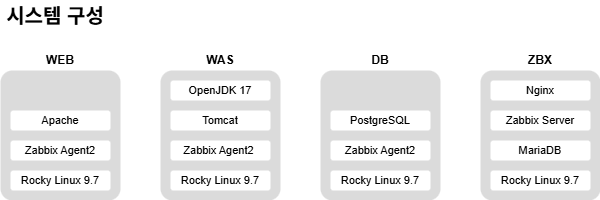

# Server TroubleShooting

## Used

## Architecture
### System
| Host | OS | CPU(Core) | Memory(GB) | Disk(GB) | Port | etc. |
|:--------:|:----:|:-----------:|:------------:|:----------:|:-----------:|:------:|
| web1 | Rocky Linux release 9.7 | 2 | 1 | 20 | 22, 80, 10050 | Google OTP 인증, Apache, Zabbix agent |
| was1 | Rocky Linux release 9.7 | 2 | 1 | 20 | 22, 8080, 10050 | Google OTP 인증, Tomcat, Zabbix agent |
| db1 | Rocky Linux release 9.7 | 2 | 1 | 20 | 22, 5432, 10050 | Google OTP 인증, PostgreSQL, Zabbix agent |
| zbx | Rocky Linux release 9.8 | 2 | 2 | 20 | 22, 10051 | Zabbix server, frontend(Nginx) |
| bastion | Rocky Linux release 9.7 | 2 | 2 | 20 | 22| - |

### S/W

## Source
- <a href="https://git.zabbix.com/projects/ZBX/repos/zabbix/browse/templates/media/slack?at=release/7.4">media.yaml</a>

## Reference
- https://httpd.apache.org/docs/2.2/mod/mod_proxy_ajp.html
- https://tomcat.apache.org/tomcat-9.0-doc/introduction.html
- https://www.zabbix.com/documentation/current/en/manual/config/notifications/media/webhook