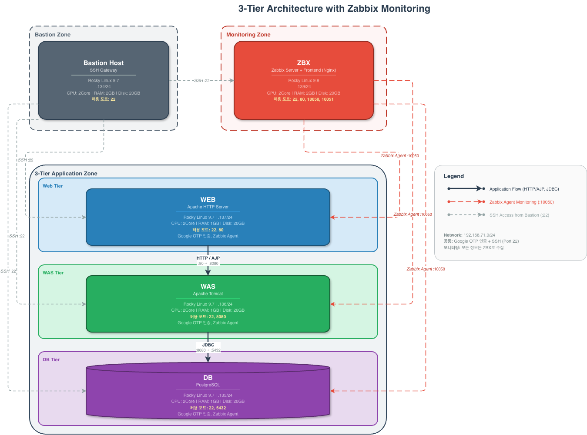
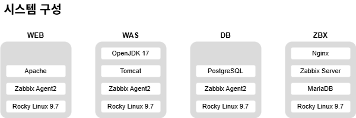

# Server TroubleShooting

## Used

## Architecture
### System

### S/W

## Source
- <a href="https://git.zabbix.com/projects/ZBX/repos/zabbix/browse/templates/media/slack?at=release/7.4">media.yaml</a>

## Reference
- https://httpd.apache.org/docs/2.2/mod/mod_proxy_ajp.html
- https://tomcat.apache.org/tomcat-9.0-doc/introduction.html
- https://www.zabbix.com/documentation/current/en/manual/config/notifications/media/webhook
